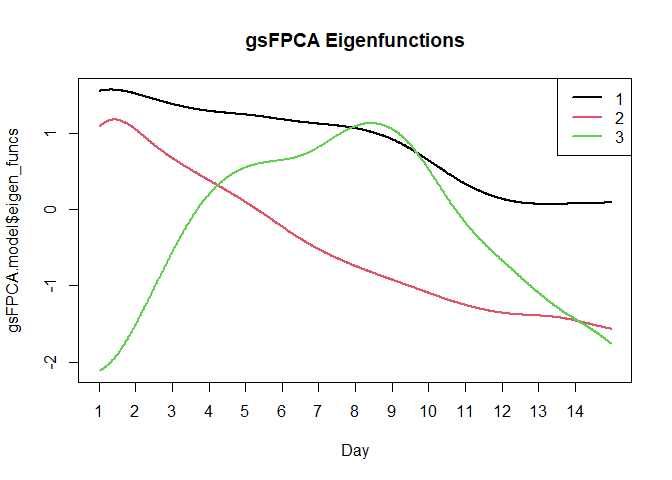
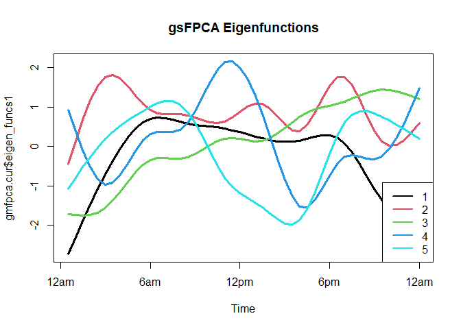

<!-- README.md is generated from README.Rmd. Please edit that file -->

# gFPCAClassif

<!-- badges: start -->
<!-- badges: end -->

The goal of gFPCAClassif is to model and train classifiers for
binary-valued functional data. The package presents model-based
classification methods for the binary-valued functional data. The
package accounts for multiple different scenarios of the data. All of
these models are built under the assumption that the binary data are
binary-valued observations of smooth latent functions. The authors would
like to acknowledge the NSF MMS grant number: SES 2020179.

## Installation

You can install the development version of gFPCAClassif like so: This
package is currently available on GitHub at
{<https://github.com/aweishampel/gFPCAClassif>}

## Example

This is a basic example which shows you how to solve a common problem:

To model the binary data, we fit the model without covariates, the
number of eigenfunctions are determined by a PVE of 0.95,

``` r
gsFPCA.model = gsFPCA(X_dat_s = X_dat_train,
                Ys = acc_data_train$group, covariates = NA,
                pve = 0.95, Kb = 10, bs0="cr")
```

The smooth trajectories are estimated using the 10 cubic regression
splines. The resulting object, , contains the estimated mean function,
eigenfunctions, and the account’s corresponding principal component
scores. The estimated principal components scores for each account can
be easily viewed in the output by:

``` r
head(gsFPCA.model$scores_train)
#>             psi1        psi2        psi3
#> [1,]  0.46425138 -0.23886527 -0.12459635
#> [2,]  0.68930728 -0.12412110 -0.19138972
#> [3,] -0.57787830 -0.26004744  0.03867028
#> [4,]  0.73441177 -0.21517720 -0.16258036
#> [5,] -0.01012554 -0.06334019 -0.08914326
#> [6,]  0.34669469 -0.18249006  0.05152066
```

By providing the eigenfunctions and scores, researchers are able to
interpret the values of the principal component scores and better
understand the accounts’ posting patterns. The eigenfunctions are
visualized by using the function:

``` r
matplot(gsFPCA.model$eigen_funcs, type="l", lwd = 2, 
        lty = 1, xlab = "Day", 
        main = "gsFPCA Eigenfunctions", xaxt="n")
axis(1, at = (0:13)*48+1, labels = 1:14)
legend("topright", 
       legend = 1:length(colnames(gsFPCA.model$scores_train)),
       col = 1:length(colnames(gsFPCA.model$scores_train)), 
       lty=1, lwd=2)
```



The eigenfunctions explain the variability in posting patterns. For
example the first eigenfunction has a slight decline over the two weeks
and is positive throughout the study duration. This eigenfunction
indicates that the overall frequency of posts is a main source of
variability among accounts’ posting patterns. The second eigenfunction
addresses differences in the posting behavior between the first week
versus the second week. Finally, the third eigenfunction addresses
differences of the posting habits during the middle of the study from
the posting habits at the beginning and end of the study.

To predict the groups of new individuals we use the function and input
the trained with the posting data from the new accounts,

``` r
gsFPCA.results = gsFPCA_predict(gsFPCA.model,
                        X_dat_s_new = X_dat_test)
```

The function predicts the groups of new accounts based on their binary
functional data. Comparing the results to true values show us that the
accurately discriminate 88% of the users.

``` r
 table(gsFPCA.results, acc_data_test$group)
#>               
#> gsFPCA.results  1  2
#>              1 44  6
#>              2  6 44
```

The previous analysis trained and tested the classifier using only the
binary-valued functional data. We can include the number of followers
for each account as an additional covariate in the nonparametric Bayes
classifier. The updated model was fitted considering the number of
followers and binary functional data is fit and evaluated by:

``` r
gsFPCA.model.ff = gsFPCA(X_dat_s = X_dat_train,
                      Ys = acc_data_train$group, 
                      covariates = cbind.data.frame(followers =
                      acc_data_train$followers_count),
                      pve = 0.95, Kb = 10, bs0="cr")
gsFPCA.results = gsFPCA_predict(gsFPCA.model.ff,
                      X_dat_s_new =  X_dat_test,
                      covariates_new=cbind.data.frame(followers=
                      acc_data_test$followers_count))
table(gsFPCA.results, acc_data_test$group)
#>               
#> gsFPCA.results  1  2
#>              1 46 17
#>              2  4 33
```

Adding the number of followers for each account actually decreased the
performance of the classifier as the updated classifier accurately
labeled 82% of the new accounts. Similar results are observed when
including the number of friends into the models.

As explained in Section , Both the and the models are implemented using
the function. To apply the multi-level structure to the social media
data, the provided binary data need to be restructured. In the previous
approach, the binary data for an account was treated as a single series
of observations from the two week interval. In the multi-level approach,
the data consists multiple series per individual. In the social media
application we consider each day is a separate series. Due to the nature
of the social media data, there are days, when the account does not post
at any point during day. Because there can be inactive days the is more
appropriate to model the data.

Recall, the binary data are formatted based on 30 minute intervals
therefore there are 48 observations per day,
.
Therefore to format the binary-valued matrix as described in Section ,
we need to have each row correspond to a given individual on a given
day. The formatted binary data of the training and testing set accounts
for the multi-level models are provided in the and matrices. The
formatted data is used to fit the by:

``` r
gmfpca.cur = gMFPCA(X_dat = X_dat_m_train,
                    Ys = acc_data_train$group, J = 14, N=400, 
                    covariates = NA, gAR = T, q = 3, pve1 = 0.95,
                    pve2 = 0.75,  approximation = "linear")
```

Based on the data, the probability of an account posting within the 30
minutes interval is large enough such that the linear approximation
method is recommended. If this probability is small and posts are rare,
then the exponential approximation is more appropriate. The trained
model contains the mean function, both sets of eigenfunctions, scores,
and the trained models for each group. The individual level
eigenfunctions (Figure ) can be displayed using the following code. The
individual level eigenfunctions explain how the posting patterns within
a day differs among accounts.

``` r
matplot(gmfpca.cur$eigen_funcs1, type="l", lwd = 3, lty = 1,
        xlab = "Time", main = "gsFPCA Eigenfunctions", xaxt="n")
axis(1, at = (0:4)*12, labels = c("12am", "6am", "12pm",
        "6pm", "12am"))
legend("bottomright", 
        legend=c(1:length(gmfpca.cur$eigen_vals1)),
        col=1:length(gmfpca.cur$eigen_vals1), lty=1, lwd=2)
```



Because there are two groups in the provided data, there are two fitted
models in the object, one model for each group. The lag in the both of
these models is to be
.
The fitted model for the genuine accounts can be retrieved and viewed by

``` r
 gmfpca.cur$gar_models_ls[[2]]
#> $model
#> 
#> Call:  bayesglm(formula = formula.cur, family = binomial, data = data.s.cur2, 
#>     prior.df = Inf, scaled = FALSE)
#> 
#> Coefficients:
#> (Intercept)           S1           S2           S3  
#>     -0.9244       2.8785       2.2737       0.4148  
#> 
#> Degrees of Freedom: 2199 Total (i.e. Null);  2196 Residual
#> Null Deviance:       367.5 
#> Residual Deviance: 279.2     AIC: 287.2
#> 
#> $initial_probs
#> [1] 0.005415162 0.001805054 0.001353791 0.010379061 0.002707581 0.009927798
#> [7] 0.012184116 0.956227437
#> 
#> $initial_combos
#>      Var1 Var2 Var3
#> [1,]    0    0    0
#> [2,]    1    0    0
#> [3,]    0    1    0
#> [4,]    1    1    0
#> [5,]    0    0    1
#> [6,]    1    0    1
#> [7,]    0    1    1
#> [8,]    1    1    1
```

The model consists of two components: the autoregressive model estimates
and the initial probabilities. The initial probabilities are the
probabilities which define the estimated probability mass function for
the possible combinations of the first

initial states. From the fitted it is clear that the automated account’s
active state is highly affected by the active status of the previous two
days.

The function is used to predict the groups given the binary-valued
functional data for new accounts.

``` r
gmFPCA.results = gmFPCA_predict(gmfpca.cur, 
                                X_dat_m_new = X_dat_m_test)

table(gmFPCA.results, acc_data_test$group)
#>               
#> gmFPCA.results  1  2
#>              1 50  1
#>              2  0 49
```

The trained classifier is able to accurately discriminate 99% of the
accounts in the testing set. This accuracy is larger than the gsFPCA
approach, suggesting that group differences occur in the within day
posting patterns.
